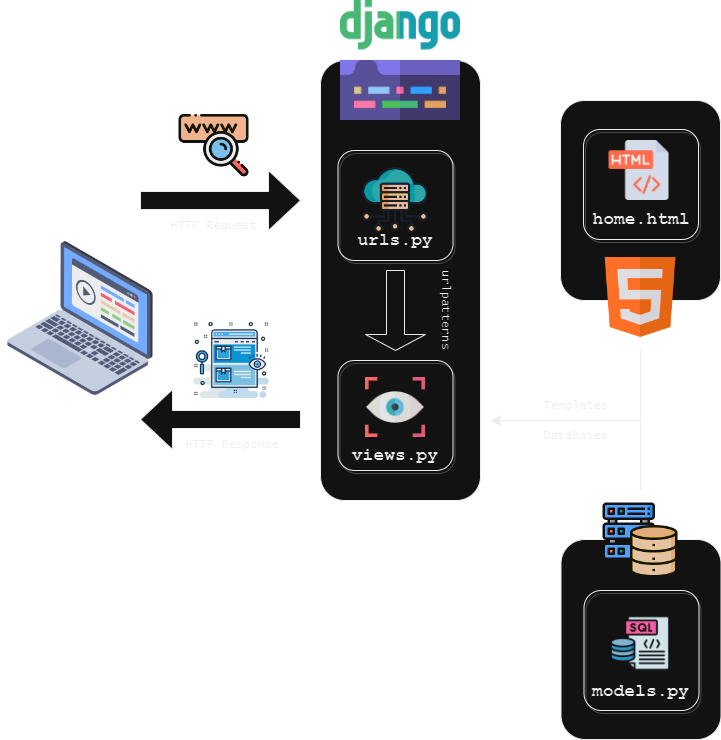

## Tugas Individu PBP

# stok-makanan

### [Aplikasi](https://stok-nyamnyam.adaptable.app/)

## 1. Cara Implementasi

1. Memilih direktori lokal yang akan menyimpan proyek Git dan melakukan inisiasi repositori baru dengan berintah `git init`.

- Menghubungkan keduanya dengan perintah `git remote add origin <url_repo_github>`.
- Membuat virtual environment untuk projek baru ini dengan `python -m venv env` dan mengaktifkannya `env\Scripts\activate.bat`.
- Pada direktori yang sama, saya menambahkan berkas `requirements.txt` yang berisi dependencies sebagai berikut:
  ```
  Django
  Gunicorn
  Whitenoise
  psycopg2-binary
  requests
  urllib3
  ```
- Memasang dependencies dengan perintah `pip install -r requirements.txt`
- Membuat proyek Django baru Bernama `stok_makanan` dengan perintah `django-admin startproject stok_makanan .`
- Menambahkan file `.gitignore`
- Mengatur akses aplikasi web dengan menambahkan `\*` pada `ALLOWED_HOST` pada `settings.py`
- Mendaftarkan `main` dalam proyek _stok makanan_:
  - Membuat aplikasi `main` dalam proyek `stok_makanan` dengan `python manage.py startapp main`
  - Menambahkan `main` ke `INSTALLED_APPS` dalam `settings.py`
- Menambahkan direktori `template` pada direktori `main`
- Menambahkan file `main.html` dalam direktori `templates` pada aplikasi `main` yang nantinya akan menampilkan data aplikasi
- Menambahkan fungsi `show_main` pada `views.py` yang ada pada direksori aplikasi `main` yang berfungsi mengatur permintaan HTTP dan mengembalikan tampilan yang sesuai.
- Melakukan routing URL
  - Mengonfigurasi routing URL aplikasi main agar dapat diakses melalui peramban web
    - Membuat berkas `urls.py` dalam direktori `main`, seperti yang telah diberikan saat tutorial
  - Mengonfigurasi routing URL proyek untuk menghubungkannya ke tampilan `main`
    - Menambahkan rute URL pada `urls.py` dalam direktori proyek `stok_makanan`, seperti yang telah diberikan saat tutorial
- Mengubah berkas `models.py` dalam aplikasi `main` sesuai kebutuhan
  - Menambahkan `Item` dengan atribut `name`, `amount`, dan `description`
    - name sebagai nama item dengan tipe CharField.
    - amount sebagai jumlah item dengan tipe IntegerField.
    - description sebagai deskripsi item dengan tipe TextField.
- Menambahkan unit test `tests.py` pada direktori aplikasi `main`, seperti yang diberikan pada tutorial
- Melakukan deployment proyek pada Adaptable.io, seperti yang dicontohkan pada tutorial dengan melakukan penyesuaian yang dibutuhkan dan start command `python manage.py migrate && gunicorn stok_makanan.wsgi`

## 2. Bagan



Penjelasan bagan:

1. Client memerintahkan peramban web untuk mengunjungi situs berbasis django.
2. Peramban akan mengirimkan `HTTP Request` dari client ke server situs yang dikunjungi. Request akan dihandle oleh `urls.py`.
3. Setelah pattern ditemukan, function dalam `views.py` yang sesuai (fungsi yang terikat dengan url tersebut) akan memproses request client. `models.py` menyimpan data dan logika aplikasi. `views.py` memproses request dengan menampilkan data dari model (models.py) dan menghubungkannya dengan template (.html).
4. Setelah itu, peramban web akan mengirimkan halaman web yang diminta client berupa `html`. Peramban client merender `html` sebagai `HTTP Response` dari server django.

## 3. Virtual Environment

### Mengapa menggunakan virtual environment?

Penggunaan virtual environment pada proyek django lebih disarankan dibandingkan tanpa menggunakannya.Virtual environment berguna untuk mengisolasi package serta dependencies dari aplikasi sehingga tidak bertabrakan dengan dependencies lain yang ada pada komputer. Jika dibayagkan, pada tiap proyeknya kita akan memiliki python yang berbeda. Hal ini membantu kita dalam mengelola dependencies proyek sehingga dapat menghindari terjadinya konflik.

### Apakah aplikasi web berbasis Django dapat dibuat tanpa menggunakan virtual environment?

Ya. Proyek django tetap dapat dibuat tanpa menggunakan virtual environment selama python sistem kita memiliki depedensi yang akan digunakan.

## 4. MVC, MVT, dan MVVM

Konsep arsitektur dalam pengembangan web untuk memisahkan komponen-komponen utama sebuah aplikasi. Hal ini akan memungkinkan pengembang web untuk mengorganisasi dan mengelola kode dengan lebih terstruktur.

### MVC (Model View Controller)


Model: bagian yang mengelola data dan logika aplikasi
View: bagian yang mengatur tampilan data dari model
Controller: bagian yang bertugas mengatur _flow_ interaksi `model` dan `view`. Meneruskan hasil manipulasi data dari `model` ke `view` yang akan ditampilkan pada layar pengguna

### MVT (Model View Template)


Model: bagian yang mengelola data dan logika aplikasi
View: bagian yang menampilkan data dari `model` dan menghubungkannya dengan `template`
Template: bagian yang mengatur tampilan antarmuka pengguna (serupa dengan `Controller` pada `MVC`)

### MVVM (Model View ViewModel)


Pola desain yang membedakan UI dengan logika dari aplikasi. `Viewmodel` serupa dengan `Controller`. Konsep ini memungkinkan pengembang melakukan pemisahan kerja yang lebih baik antara UI dengan logika.

Model: bagian yang mengatur data dan logika aplikasi
View: bagian yang mengatur tampilan antarmuka pengguna, tetapi tidak mengolah data
ViewModel: bagian yang menghubungkan `model` dan `view`, meneruskan data yang akan ditampilkan ke `view`

## Perbedaan

Pada konsep MVC, pemisahan kerja lebih tegas dibanding konsep lainnya. Bagian yang serupa dengan `Controller pada MVC` adalah `Template pada MVT` dan `ViewModel pada MVVM`. Meski demikian, terdapat perbedaan di antara ketiga konsep, seperti yang telah disampaikan sebelumnya.
